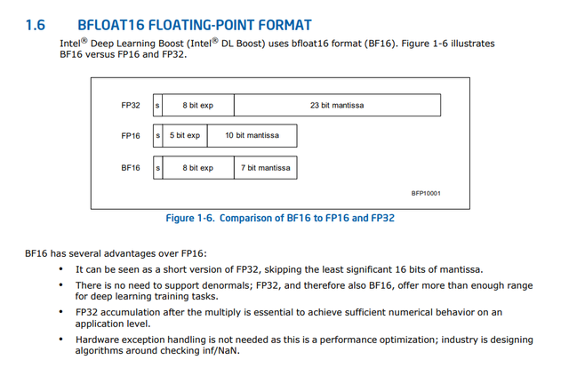

# Optimized Faiss

This is an optimized version of Faiss by Intel. It is based on open-sourced Faiss 1.6.3.

To build original Faiss with no optimization, just follow the original build way, like:

```
./configure --without-cuda
make clean
make
```

Up to now, features included are as followings:

## - IVFPQ Relayout

This feature changes the layout of PQ code in InvertedLists in IndexIVFPQ. The new layout not only improves the cache hit rate, but also enables compiler-level SIMD optimization.

To enable this feature, you should append `--enable-ivfpq-relayout` to `./configure`, such as:

```
./configure --without-cuda --enable-ivfpq-relayout
make clean
make
```

Then, an IndexIVFPQ instance can be set to use this feature by such code:
```
# in Python
ps = faiss.ParameterSpace ()
ps.set_index_parameter (index, "ivfpq_relayout", 4)
```
or
```
# in C++
faiss::ParameterSpace ps;
ps.set_index_parameter (index, "ivfpq_relayout", 4);
```
where *ivfpq_relayout* means the group size of relayout. Although *ivfpq_relayout* can be any non-negative integer, but 4 is usually the best based on experience.

You can set *ivfpq_relayout* to any non-negative integer at any time, no matter before or after trainging or adding vectors. The only drawback is that, if you set *ivfpq_relayout* when IndexIVFPQ already has some base vectors, it will take some time to convert the memory layout.

The feature doesn't change the format of index writen to disk, so is compatible with old index files.

## - DType (Diverse Type)

This is a family of extension, including new metric types, new data types and new implementation types. 

### -- Metirc Type

Two new metric types, *METRIC_L2_EXPAND* and *METRIC_PROJECTION* are added to *MetricType*.

*METRIC_L2_EXPAND* is similar to *METRIC_L2*, but it calculates `y*y - 2*x*y`. It has same effect if you only case the recalling and ranking, but ignore the calculated distances. *METRIC_L2_EXPAND* is better than *METRIC_L2* in that the calculation is more efficient to take advantage of BLAS.

*METRIC_PROJECTION* is to calculate the length of projection of *x* in the direction of *y*. Ff you only case the recalling and ranking, it has same effect as Cosine Distance.

### -- Data Type

This feature also enhances Index with optional data types (of internal storage). Currently, *FP32* and *BFP16* are supported. This feature makes it possible to get a balance between accuarcy and performance. Take BFP16 for an example, BFP16 can be seen as a short version of traditional single float-point, FP32, skipping the least significant 16 bits of mantissa. Compared with FP16 which is supported by GPU, it provides as large range as FP32 (while FP16 has much smaller range) with the sacrifice of precision. The benifit is that the memory size and bandwidth is half of that of FP32, which offers much lower latency and much higher throughput.



### -- Implementation Type

The original Faiss doesn't use BLAS when scanning *InvertedList*. This feature brings a serial of *InvertedListScanner* using BLAS.


To enable these features, you should append `--enable-flat-dtype` and `--enable-ivfflat-dtype` to `./configure`, such as:

```
./configure --without-cuda --enable-flat-dtype --enable-ivfflat-dtype
make clean
make
```

An instance of IndexFlat can be built by such code:
```
# in Python

# an original 128-dimension IndexFlat
index1 = faiss.index_factory (128, "Flat")

# a 128-dimension IndexFlat using FP32 to store vectors
index2 = faiss.index_factory (128, "FP32,Flat")

# a 128-dimension IndexFlat using BFP16 to store vectors
index3 = faiss.index_factory (128, "BFP16,Flat")
```
or
```
# in C++

# an original 128-dimension IndexFlat
Index* index1 = faiss::index_factory (128, "Flat")

# a 128-dimension IndexFlat of L2_EXPAND using FP32 to store vectors
Index* index2 = faiss::index_factory (128, "FP32,Flat", faiss::METRIC_L2_EXPAND)

# a 128-dimension IndexFlat using BFP16 to store vectors
Index* index3 = faiss::index_factory (128, "BFP16,Flat")
```

An instance of IndexIVFFlat can be built by such code:
```
# in Python

# an original 128-dimension Index1024,Flat
index1 = faiss.index_factory (128, "IVF1024,Flat")

# a 128-dimension Index1024,Flat using FP32 to store vectors
index2 = faiss.index_factory (128, "FP32,IVF1024,Flat")

# a 128-dimension Index1024,Flat using BFP16 to store vectors
index3 = faiss.index_factory (128, "BFP16,IVF1024,Flat")
```
or
```
# in C++

# an original 128-dimension Index1024,Flat
Index* index1 = faiss::index_factory (128, "IVF1024,Flat")

# a 128-dimension Index1024,Flat using FP32 to store vectors
Index* index2 = faiss::index_factory (128, "FP32,IVF1024,Flat")

# a 128-dimension Index1024,Flat using BFP16 to store vectors
Index* index3 = faiss::index_factory (128, "BFP16,IVF1024,Flat")
```

When in conjunction with *Flat DType*, it is possible to build a mixed IVFFlat. For example, *"FP32,IVF1024,BFP16,Flat"* builds an IVFFlat where the first layer is a FP32 Flat, while the second layer is BFP16 Flat.

The new IndexFlat and IndexIVFFlat with DType is **NOT** compatible with old index files. So you need to train and save a new one.

